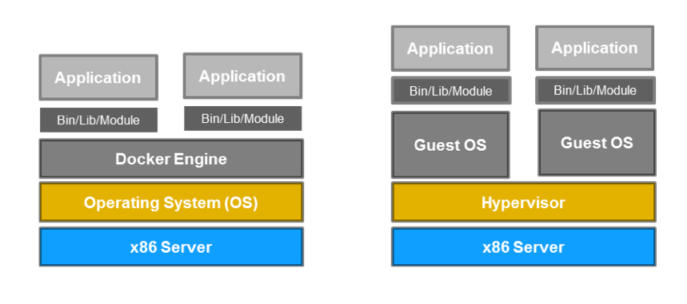

# Linux Intro and Command-Line Basics

## Intro
The Linux command line uses a variety of flavors of 'Unix', an operating system first developed in the 1960s. In general, the unix command format is as follows:

```
command argument1 argument2 --option1name option1value ...
```

E.g, you can use the `--help` option, which nearly every command has, to query the usage for the copy command, `cp`, with:
```
cp --help
```

You can think of every command like a shortcut - the actual functionality of the command is located in code elsewhere from your 'current location' on DynoSparky - but by evoking its name you request that code to be executed. If you are entirely new to Unix, you may find Andrew Jahn's [Unix for Neuroimagers](https://andysbrainbook.readthedocs.io/en/latest/unix/Unix_Intro.html) to be an extremely comprehensive resource.  

## Cheat Sheet

| Command | Description |
| --- | -------------- |
| `ls` | Lists all files and directories in the present working directory |
| `ls -a` | Lists hidden files as well |
| `ls -l` | Lists vertically with detailed information |
| `ls -la` | *You can combine flags like so!* |
| `cd ~` | Navigate to $HOME directory |
| `cd ..` | Navigate one level up |
| `cd <path>` | Navigate to <path> |
| `pwd` | Prints the full path of the current directory |
| `cat <file>` | Prints the contents of a file |
| `mv <source> <destination>` | Move a source file or rename to destination |
| `cp <source> <destination>` | Copy a source file to destination |
| `cp -r <source> <destination>` | Copy a source folder to a destination |
| `rm <file>` | Permanently delete a file |
| `rm -r <folder>` | Permanently delete a folder |
| `sudo` | Placing 'sudo' in front of a command is like running as administrator |
| `clear` | Clears the terminal window |
| `echo $VARIABLE` | Displays value of variable |
| `ssh -Y user@remoteaddress` | Connect remotely to a server via secure shell |
| `ssh -X -Y user@remoteaddress` | Start SSH connection with X11 forwarding (graphical applications run locally) |
| `touch <filename>` | Create an empty file, at <filename> |
| `echo "sometext"` | Print "sometext" to standard output |
| `echo "sometext" >> <filename>` | *Append* "sometext" to file |
| `echo "sometext" > <filename>` | Write "sometext" *from scratch* to file |
| `nano <filename>` | Edit a file in the nano text editor |
| `vim <filename>` | Edit a file in the vim text editor |
| `grep "filterkey"` | Filters a standard output for lines containing "filterkey" |
| `cmd1 | cmd2` | Pipe stdout of cmd1 to cmd2 |
| `CTRL-c` | Stop current command |

These are just a few and some of the most powerful / common of many built-in commands.

## Software Environment
### C Shell Configuration File
`.cshrc` is a file that is executed each time you execute a new shell (i.e., each time you log in, open a new Remote Desktop session or Xterm window). [.cshrc Docs](https://www.doc.ic.ac.uk/csg-old/linux/Cshrc.html)

You can take advantage of `.cshrc` to built yourself shortcuts, aliases, and set up user configurations.

E.g., if you're constantly using the command `ls -l` instead of regular `ls`, and it's becoming tedious to type in, you can add a line in your `.cshrc` which builds an alias for you:
```
alias l 'ls -l'
```
Then after either relaunching a session, or running `source ~/.cshrc` to load the file, you can use `l` in lieu of `ls -l`.

### Virtual Environments
#### venv
One important environment we make use of in the LCBD is [venv](https://docs.python.org/3/library/venv.html). Like other systems, such as [anaconda](https://www.anaconda.com/), a virtual env

#### anaconda

### Docker
Docker is a software we have access to on DynoSparky, which allows us to build, run, and store "containers". Many software for data analysis are offered via Docker containers, which are packaged applications that make the execution of the software much more straightforward and consistent.

For example, when the latest releases of MRIQC, FMRIPREP, and LCBD scripts all rely on different versions of the PyDicom package, a Docker container works as a solution. In the figure below, Docker containers are represented on the left, and virutal machines on the right.


