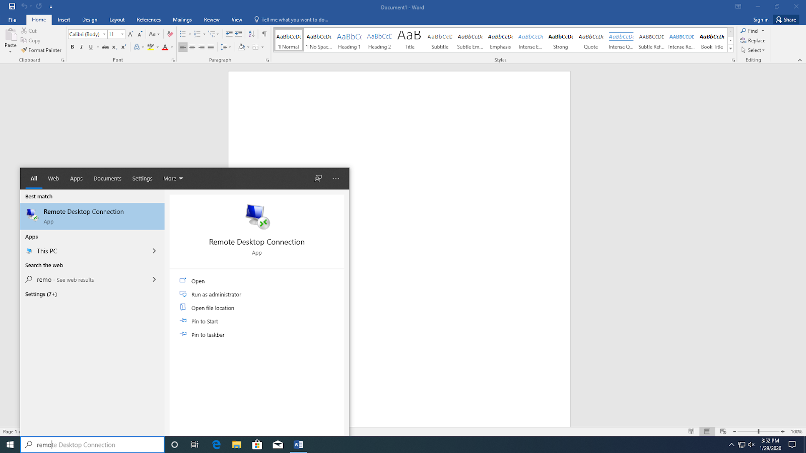

Once users are approved by CSG, there are a few options to access DynoSparky:

## MobaXTerm (Windows Only)
[MobaXterm](https://mobaxterm.mobatek.net/) is a graphical software which manages SSH sessions very nicely in Windows. It is a relatively simple alternative to remote desktop which saves computational resources, and is highly recommended for Windows users, with the main caveat being that copy/paste commands are not very intuitive. You can do either by right clicking. The default paste command is shift-insert, not ctrl-v as you may be used to. 

1. To get started, launch MobaXterm.

    
    
2. Once launched, click the button in the top-left that says "session". 

    
    
3. A new window will appear where you can enter the details of our session (these will be saved for later, you only need to do it once). Click the button in the new window that says "SSH" (secure-shell protocol). This ensures a safe connection between the local PC and DynoSparky. Note: if you're using this from home, you need to be connected to the WUSTL VPN. 

    
    
4. Click "OK", and then fill in your user details as shown below. Ensure each of the highlighted areas matches, but use your username instead. The full remote host is `dynosparky.neuroimage.wustl.edu`. 

    
    
5. Click "OK", and you should be prompted for your NIL password as usual. 

    

## Remote Desktop
Remote desktop takes advantage of Xubuntu to provide a graphical interface for navigating DynoSparky. This will be the most natural gateway for users who have not had experience navigating Linux systems via command prompt, or using SSH tunneling - however it is recommended that you spend time learning to use the terminal. Using remote desktop occupies much of the limited compute resources needlessly, and prevents our neuroimaging analyses from running quickly and in parallel. For some tasks and users, remote desktop is a sensible approach, and below are the instructions for using it in such situations.

### For Mac Users
1. Download [Microsoft Remote Desktop](https://apps.apple.com/us/app/microsoft-remote-desktop-8/id715768417?mt=12) from the AppStore (either version 9 or 10).
2. Once installed, open the App and click "New" at the top to set up a new connection.
3. For "PC Name", enter "dynosparky.neuroimage.wustl.edu". Under credentials, enter your NIL username (user camachoc is displayed below as an example). Note that this is NOT your WUSTL ID, this is your NIL login - they are separate credentials.

    

4. The other settings can be as you wish. The "Connection Name" is what the connection will be listed as in the App. You may choose to not leave your password entered, in which case you'll be prompted to enter it later. You may choose to check or uncheck the boxes at the bottom that determine how the window appears on your monitor.
5. Close the Edit window. The new connection will now be listed in the main window of the app.

    

6. Double click the connection to start. The first time that you connect, the App will ask if you want to trust the server. Click yes.
7. If you did NOT enter your password as part of the connection setup, you will see an error message. Click "Ok", then you will see the screen below. Log in with your NIL username and password.

    

8. Once you are logged in, you should see your desktop, and can proceed to the DynoSparky first-time setup documentation.

### For Windows Users
1. Search for the "Remote Desktop Connection" default Windows application, and open it.

    

2. Once the window opens, click the "Show Options" down-arrow to expand the window. For Computer, enter `dynosparky.neuroimage.wustl.edu`. For User name, enter your NIL user name. Note that this is NOT the same as your WUSTL login.

    

3. If you are using a personal computer or account, you can opt to check the "Allow me to save credentials" box to reduce how often you have to log in. You can also click "Save As" and save the Remote Desktop Connection to your desktop to make it quicker to connect in the future.
4. Double-click your new connection or click "connect" from within the Remote Desktop Connection App. You will be prompted to log in with your NIL credentials. The first time you log in, you will get a message asking to allow connections with the remote computer, or if you can trust the certificate. For both, click "Yes" or "Allow". You can also check the "Don't ask me about this again on this computer" box to avoid having to give permission again later the next time you log in.
5. Once you have logged in and provided permission to connect, you should see your desktop. If this is your first time connecting, you can proceed to the DynoSparky first-time setup documentation.

## Secure Shell (Terminal / Command Prompt)
Secure Shell ([SSH](https://en.wikipedia.org/wiki/Secure_Shell)) is a secure network protocol for operating services securely, even over unsecured networks. Even so, you must be connected to the [Medical School VPN](https://cpb-us-w2.wpmucdn.com/sites.wustl.edu/dist/5/1185/files/2018/04/vpn-Windows-MED-new.pdf) in order to connect.

On any operating system, you can connect to DynoSparky using SSH.

1. Ensure you are connected to the VPN
2. Open the Mac Terminal, Windows Command Prompt, or Linux Terminal

    

3. Type `ssh -Y NILUSER@dynosparky.neuroimage.wustl.edu` and hit ENTER. You should now be prompted to enter your password. Enter your password and hit enter (no asterisks will appear, like when you enter a password on a website). It may take a moment to connect.

    

4. If your OS is compatible with X11 forwarding, you may also use the `-X` flag to allow ssh to display graphical programs on your local computer. This is favored over using Remote Desktop, because the computational resources required to display the program are offloaded from DynoSparky, allowing the server to remain optimized in its role for multiple simultaneous connections. On Mac, you may need to first install [XQuarts](https://www.xquartz.org/). E.g.,

```
ssh -X NILUSER@dynosparky.neuroimage.wustl.edu
```

## Setting Up for the First Time on DynoSparky
The first time you log in, you'll need to make some modifications. It will be useful first to review the [Command Line Help and Tips](https://childbrainlab.github.io/tutorials/linux_wt/) section. A great deal can be accomplished through the use of even just a few Bash commands, and it *will* save you time and energy to have them at your disposal.

Each user on DynoSparky has a login-node space. This path is abbreviated for each user to `~`, and is equivalent to `/home/user/NILUSER.` This path is not necessarily your personal storage compartment (it is quite small), but *is* used for storing information about your DynoSparky configuration, and tools which may help you navigate the servers.

### C Shell Configuration File
`.cshrc` is a file that is executed each time you execute a new shell (i.e., each time you log in, open a new Remote Desktop session or Xterm window). [.cshrc Docs](https://www.doc.ic.ac.uk/csg-old/linux/Cshrc.html)

The "." at the start of the filename indicates that it is a *hidden* file, a little-known but vastly important convention that allows terminal-users to interact with files not typically displayed in the file explorer window.

LCBD members have compiled the most ubiquitous commands and shortcuts into a template .cshrc, which you can import to your own. The template cshrc file sets up the OS, as well as some PATH and environment variables which allow your user profile to recognize shared lab software packages, such as FSL and FreeSurfer. To merge it with your personal .cshrc (located in ~/.cshrc):

1. Enter the following command:

```
echo source /data/perlman/moochie/user_data/cshrc.txt >> ~/.cshrc
```

This will append the contents of the template cshrc file to your personal configuration, `~/.cshrc`. NOTE: it is pertinent that you use `>>` and not `>` (two carats). `>>` appends to a file, whereas `>` writes the file out from scratch.

2. After making changes to cshrc, they are not automatically loaded. Your csh configuratino file is only loaded once a new connection is made. Alternatively, you can force a refresh with:

```
source ~/.cshrc
```
