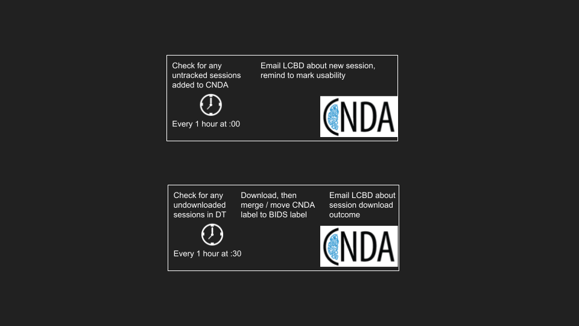

[CNDA](https://cnda.wustl.edu/) is the database to which the lab's MRI data is uploaded, immediately following its acquisition. It acts as a permanent storage base for the data, in its raw format, but is also capable of implementing automated preprocessing and analysis pipelines.   

# XNAT
CNDA's database is organized through descriptors (assessors) defined by the [XNAT](https://www.xnat.org/) platform. XNAT is an extensible open-source imaging informatics software platform dedicated to imaging-based research.

The scripts which we use to collect our MRI data from CNDA rely on the XNAT assessors and interface, in order to determine which data is required, which data is new, etc. 

# The Automated CNDA -> Moochie Pipeline

Pictured above is a simple depiction of the process for the automated CNDA data fetch which occurs automatically on Dynosparky, at intervals every hour from 6am to 8pm.

  

## Cron
The automation (repeated running) of commands on Linux servers such as Dynosparky can be achieved through the [cron tool](https://en.wikipedia.org/wiki/Cron). Through instructions stored in a "crontab" file, the cron service will automatically execute the desired jobs at regular intervals. 

Accessing the crontab is as simple as running the following command:

    crontab -e

Upon which you should see a template cron file resembling the following:

```
# Edit this file to introduce tasks to be run by cron.
#
# Each task to run has to be defined through a single line
# indicating with different fields when the task will be run
# and what command to run for the task
#
# To define the time you can provide concrete values for
# minute (m), hour (h), day of month (dom), month (mon),
# and day of week (dow) or use '*' in these fields (for 'any').#
# Notice that tasks will be started based on the cron's system
# daemon's notion of time and timezones.
#
# Output of the crontab jobs (including errors) is sent through
# email to the user the crontab file belongs to (unless redirected).
#
# For example, you can run a backup of all your user accounts
# at 5 a.m every week with:
# 0 5 * * 1 tar -zcf /var/backups/home.tgz /home/
#
# For more information see the manual pages of crontab(5) and cron(8)
#
# m h  dom mon dow   command
```
The two processes described in the figure can then be added to the cron scheduler with the following entries below the commented lines:

```
# every hour from 6am-8pm, check for new CNDA sessions and email usability reminder
0 6-20 * * * bash /data/perlman/moochie/github/LCBDtools/scripts/MRI/CNDA/CNDA_get_new_sessions.sh

# every hour from 6am-8pm at :30, make a new download queue and download anything in it
30 6-20 * * * bash /data/perlman/moochie/github/LCBDtools/scripts/MRI/CNDA/CNDA_download_queue.sh
```

The first entry runs at every minute equal to 0 (:00), hours ranging from 6-20 (6am - 8pm), at any (\*) day, week, or month. The call to [CNDA_get_new_sessions.sh](https://github.com/ChildBrainLab/LCBDtools/blob/main/scripts/MRI/CNDA/CNDA_get_new_sessions.sh) executes a procedure that checks if there are any MR sessions on CNDA, which were not previously tracked. If it finds any, it will send an email to the LCBD account with a reminder to update the 'usability' field of each scan acquisition, on CNDA, and to thereafter paste the CNDA session ID into the data tracker, where it will be identified by the next step as ready-to-download.

The second entry runs at every minute equal to 30 (:30), with the rest of the parameters unchanged. These were staggered to ensure that they don't overlap, since interfacing with CNDA twice simultaneously felt like a bad idea. The call to [CNDA_download_queue.sh](https://github.com/ChildBrainLab/LCBDtools/blob/main/scripts/MRI/CNDA/CNDA_download_queue.sh) operates by looking for any previously-undownloaded CNDA session IDs, searching within the data tracker. If it finds one, it will execute the XNAT-reliant commands to download the usable acquisitions from the session, organize them within the MRI data folder, and merge any repeated sessions. Once the download has been completed, or if it did not download correctly, the program will send another automatic email to notify the lab staff that the scan is ready to use for brain photos, and to proceed with BIDS organizatio nand FMRIPREP. 

## Dependencies
Like most other code in this toolbox, any dependencies should be successfully resolved by running the following command:

    source /data/perlman/moochie/resources/server_access/MRIenv/bin/activate
    
However, because of the extra credentials required for this pipeline, some additional solutions may be needed. 

### XNAT / CNDA Credentials
For whomever is running the scripts (from their crontab, or manually), the user will need to establish a secure credentials file in their home directory. On Moochie, this would be found in `/home/usr/USERNAME`.

To open and edit the correct (expected) file, enter the following command:

    vim /home/usr/USERNAME/.xnatPass
    
and enter the following line, formatting the WUSTLID and PASSWORD fields with your WUSTL / CNDA credentials. Remove the brackets.

    +<WUSTLID>@https://cnda.wustl.edu/REST=<PASSWORD>
    
After saving the file, we will now edit another CNDA credentials file:

    vim /home/usr/USERNAME/.netrc
    
The format of the `.netrc` file is as follows:

```
machine cnda.wustl.edu
login <cnda_userid>
password <cnda_pw>
machine https://cnda.wustl.edu
login <cnda_userid>
password <cnda_pw>
```
    
Once this has been done successfully, you should be authorized to use the XNAT pipeline!

### LCBDtools Email Credentials
In a similar configuration, the CNDA tools rely on an automated email service, authenticated through Google / Gmail. There may be additional steps required to verify the host to send emails, but ideally it is simpler than the xnatPass variant. Edit the designated filepath with the following command:

    vim /home/usr/USERNAME/.email_creds
    
On the first line, you'll enter the email address: `LCBDtools@gmail.com`. 

On the next line, you will enter a one-time generated password from the Google App Password service. If this is new to you, you can see the instructions on [this page](https://support.google.com/mail/answer/185833?hl=en). The actual password to the email account is the usual LCBD password, but for this service we need the one-time App Password, which you can generate by logging into the LCBDtools@gmail.com Google Account, selecting Security > App Passwords > Select app > Select device > Generate. Paste the generated password into the 2nd line of the `.email_creds` file. 

### Protecting Your Credentials
Since you're storing your password in a plain-text file, you'll want to enable permissions on these files such that nobody else can read them. To protect the files, run these commands:

    chmod 600 /home/usr/USERNAME/.xnatPass
    chmod 600 /home/usr/USERNAME/.netrc
    chmod 600 /home/usr/USERNAME/.email_creds

That's all! You should now be authenticated to run the entirety of the automated CNDA data retrieval procedures, automatically through the cron job scheduler.
