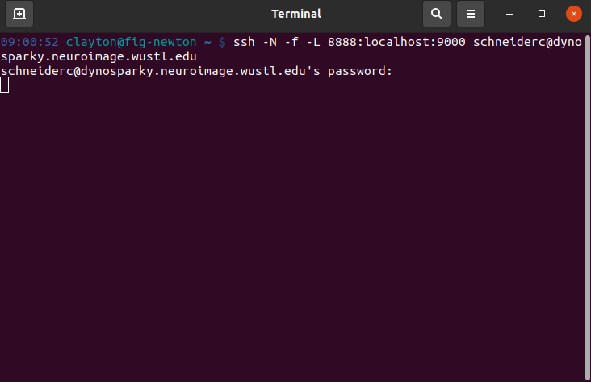
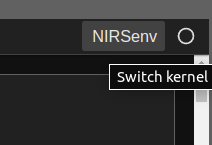
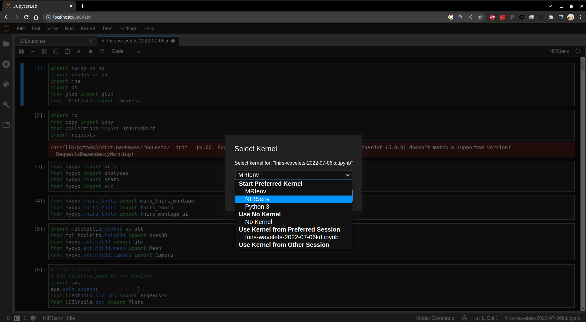

The LCBD's fNIRS processing is performed on DynoSparky in a Jupyter Notebook (IPython) environment. If you haven't yet connected to DynoSparky, see [the DynoSparky tutorial](https://childbrainlab.github.io/setting_up/DynoSparky/) for steps on starting an SSH connection.

This environment was selected for a few reasons:

- the computations happen on DynoSparky's resources, meaning your local PC or laptop won't be bogged down
- longer computations can run in the background on the Jupyter server for hours, or even days, without dropping
- the implementation of a [virtual environment](https://docs.python.org/3/library/venv.html) means that every user can instantly acquire all of the dependency packages that fNIRS analysis relies on, such as:

  - [numpy](https://numpy.org/)
  - [pandas](https://pandas.pydata.org/)
  - [MNE](https://mne.tools/stable/index.html)
  - [MNE-NIRS](https://mne.tools/mne-nirs/stable/index.html)
  - [PyCWT](https://pycwt.readthedocs.io/en/latest/)
  - and more
- moreover, the exact versions of these dependency packages are maintained across users ensuring consistent results

The process for starting and connecting to a server is a bit lengthy, but is streamlined by the use of some helpful bash scripts. Note that you must be either connected to the VPN or on WUSTL internat. The full proceedings are as follows:

1. Load the virtual environment, giving access to Jupyter and all of the dependencies
2. Launch a Jupyter Notebook server (from DynoSparky) on a specific port, in the background using [tmux](https://tmuxcheatsheet.com/)
3. Open an SSH tunnel to that port of DynoSparky on your local machine
4. Visit the tunnel in a web page to direct Jupyter from your local machine

To simplify this process, a single script, [startJupyterServer.sh](https://github.com/ChildBrainLab/LCBDtools/tree/main/scripts/NIRS/startJupyterServer.sh) takes care of steps 1 and 2, and prints exact directions for steps 3 and 4.

## Starting the Jupyter Server
Once you have opened a terminal / SSH connection to DynoSparky navigate to `/data/perlman/moochie/github/LCBDtools` using the following command:

    cd /data/perlman/moochie/github/LCBDtools
    
and subsequently run this command, inserting an appropriate port number (see below):

    bash scripts/NIRS/startJupyterServer.sh <port number>
    
where the port number is an integer between 9000 and 9999. Ideally, each lab member should consistently use the same port number, since every Jupyter server needs its own, unused port number. Most numbers should be available, but it might be sensible to use something memorable to you, for example:

- 9090
- 9000
- 9999
- 9001

## Connecting to Your Jupyter Server

If run successfully, script will output the exact details for the next steps. The DynoSparky side of things is done, and the SSH command it prints out is to be run on a **local** terminal, as shown below.

  

Once you've entered the SSH command it gives you, and authorized with your NIL password, you can open a web browser (any should be fine) and navigate to the URL, localhost:8888, where you should find the Jupyter web page. This is where you will enter the token passkey, if you haven't connected to the Jupyter server using this computer before. It will also give you the option to set a permanent password here, which you can reuse on any of your computers. 

  

If this is your first time connecting from that computer, you may be prompted for a password. If so, you can find the token in the output of the startJupyterServer.sh script, in the URL, following the phrase, "token=". Copy this string of characters and paste it into the 'password' field.

Note: you may need to tell Jupyter that you specifically want to use the NIRS environment (located at `/data/perlman/moochie/resources/server_access/NIRSenv`). When you have a notebook open, Jupyter tells you which kernel it is using in the upper right of the page:

  
  
You can click this to change the kernel to the NIRSenv so that you have access to all of the required dependencies.

  

You should now be good to proceed with your analysis.

## Ending Your Jupyter Session
If you're having problems with your server, forgot which port you're using, or need to restart the session for any reason, you can follow these steps to end your Jupyter server(s). 

1. Confirm the name of any of your tmux sessions using `tmux ls`. It will most likely be called `jupyter-server`, but depending on the steps you used to start, may also be simply a number, indexed starting at 0.
2. Kill the tmux session with `tmux kill-session -t <target>`, replacing 'target' with your tmux session name from step 1. 
3. Repeat this for any tmux sessions you have that are running a Jupyter server. Visit the [tmux cheat sheet](https://tmuxcheatsheet.com/) for more information on tmux sessions. 
